# Unit2--comsci-shin


**CLASSWORK and Development**
---------------
Making a binary counter that can count to 15

**Counting in Different Bases**
Our basic counting system is counting in base 10. This means that there are 10 possible digits - 0,1,2,3,4,5,6,7,8,9. When we reach the final digit in base 10 (9), we go up a digit to 10, then continue. Binary is counting in base 2- using only 1 and 0.
Counting in Binary is as follows-


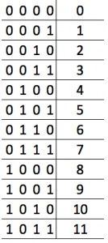

Other Examples-
Base 4- 0,1,2,3,10,11,12,13,20,21,22,23,30...
Base 8- 0,1,2,3,4,5,6,7,10,11,12,13,14,15,16,17...

**Conversion of Binary-Decimaal and Vice Versa**
From Binary-Decimal
-Line up the squares of 2- starting from 2^0 at the first digit, 2^1 , 2^2, and on and on.
-For every digit, if there is a 0, neglect the power of two that is assosciated with the digit
-For every digit, if there is a 1, add the power of two that is assosciated with the digit to a sum.
-The sum is your decimal number

Example- 10011011 to decimal
8 digits- left to right - 1, 2, 4, 8, 16, 32, 64, 128
There are 1's on the 1st,2nd,4th,5th,8th digits
Add the powers of two corresponding to digits- 1+2+8+16+128
Decimal = 155

From Decimal-Binary
divide decimal number by 2 until reaching 0, for every remainder, a 1, for every division without remainder, 0

Example- 63 to binary
63/2 = 31 r1 . 31/2 = 15 r1, 15/2 = 7 r1, 7/2 = 3 r1, 3/2 = 1 r1, 1/2 = 0 r1
binary- 111111

**Logic Gates**

Logic Gates are used to express conditions in boolean algebra.
2 states- True(1)/False(0) can be expressed in boolean algebra.
Shows inputs, and results of outputs.

NOTGATE- Turns 1 input into opposite as output- 1->0, 0->1.

ANDDGATE- Has 2 inputs, 1 output. if both inputs are 1, output becomes 1, all other conditions result in output 0

NANDGATE- Serves as an And gate with a Not following it.outputs are opposite of AndGate. Output is only 0 when both inputs are 1.

ORGATAE- If one of the two inputs are 1, the output will be 1, both inputs can be 1 and output will still be 1

NORGATE- If one of the two inputs are 1, the output will be 0, only instance of  output=1 is when both inputs are 0

XORGATE(exclusive or)- If one of the two inputs are 1, the  output will be 1, if both inputs are 1, output will be 0.

XNORGATE(exclusive not or)- Combining XORGATE and XNORGATE, the output will be 1 if both inputs are 0, or if both inputs are 1.

Truth tables are tables that show the values of inputs and outputs (0/1) based on the logic gate.


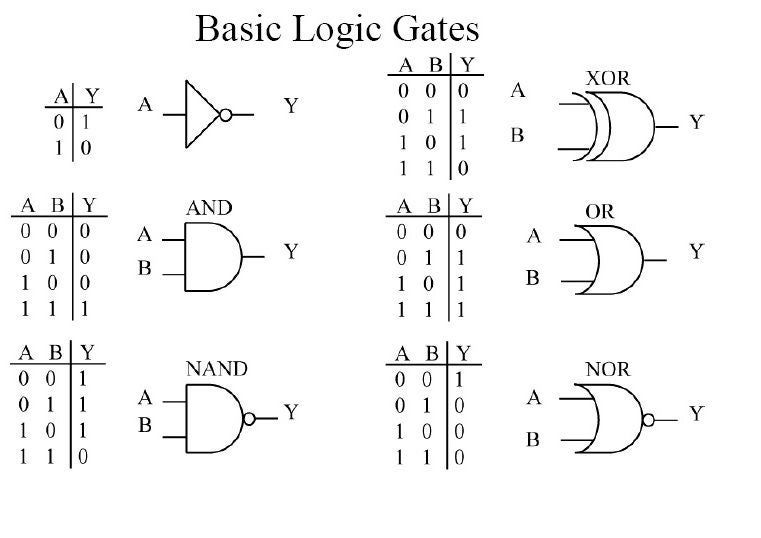


These Logic gates can be used in diagrams to simplify boolean problems, and construct code that is more efficient, as the diagrams will show you the necessary outputs, and will save you from coding each conddition seperately.
These logic gate diagrams can be converted into boolean algebra

The logic gates expressed in boolean algebra are as follows, 
F=output
A=Input1 B=Input2

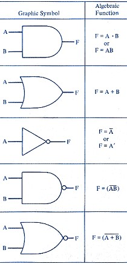

These are the rules of Boolean Algebra

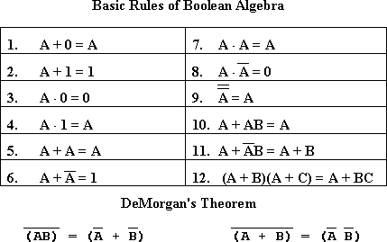

s
Example Diagram

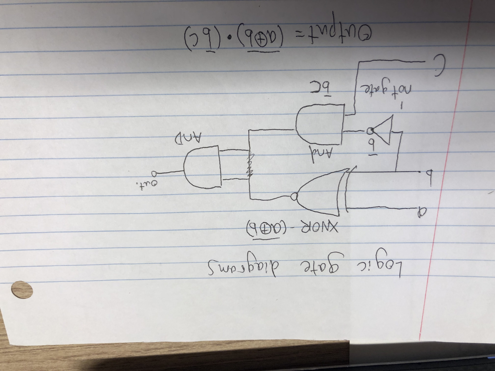

**KMAPs and boolean algebra**
Kmaps are a method of turning inputs/outputs into boolean algebra
This works by mapping the possible inputs/outputs on a table, pairing 1s and finding constants and adding them.

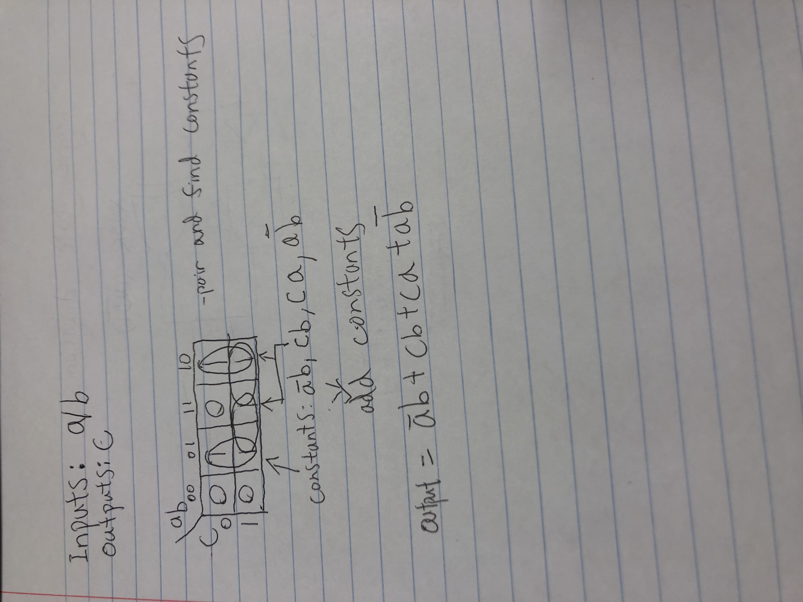


**Segments Converter**

Task- using leds, make a number display going from 0-7 which operates on 3 buttons
Solution- Make a truth table, inputs are A B C, line numbers 0-7 as outputs, then individually look at which leds will have value 1, 0 for each number displayed, using these values, make kmaps to figure out what to code.

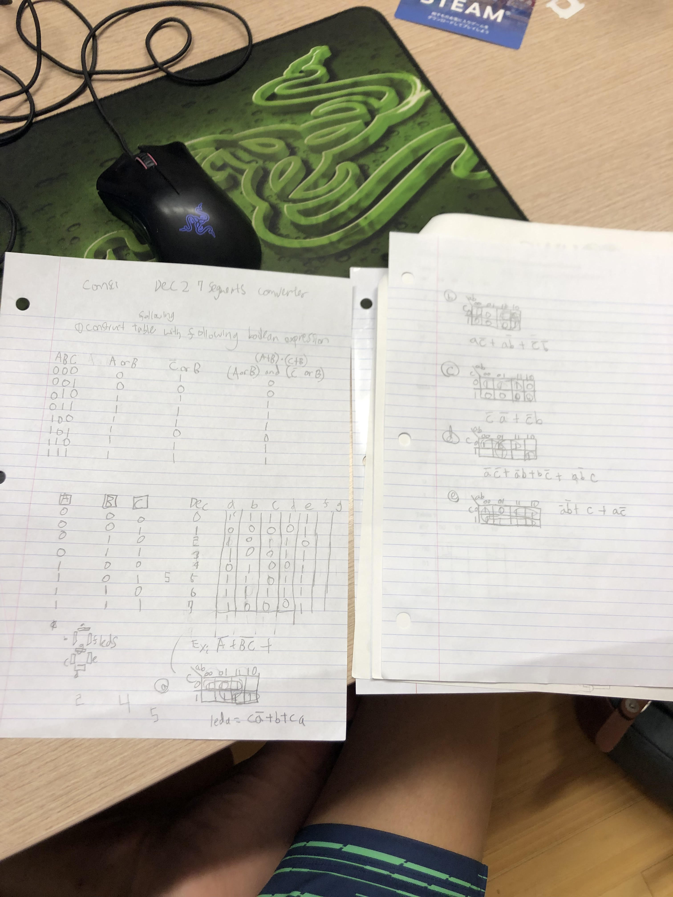


s


**What Is Usability???**
Definition: Ease of access and use of a product, to achieve its goal.
citation-https://www.interaction-design.org/literature/topics/usability

**Human-Centered Design (HCD)**
Discoverability- when a product is designed in such a way that the user can tell its functions/capabilities from looking/interacting with it.
Feedback- 

**Binary- Hexadecimal**
Hexadecimals are used as shortened ways to expresss binary.
It utilizes base 16, using characters 0-9-A-F


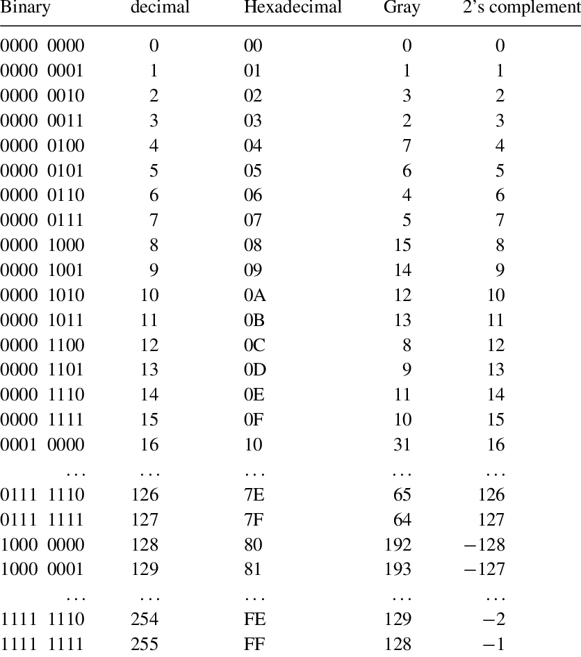


**The Machine Cycle**
We learned the machine cycle, as well as a program that stores a number 20 into ram slot 14
Cycle of processes are as follows- Fetch(retrieve instruction from memory), Decode(translate retrieved instruction into commands), Execute(run the command)
Registries-temporary storages
Ram-memory
CPU-executes the programs
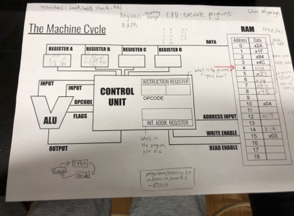


**Learning CODE**
----------
Learning to use arduino
1 configuring 3leds 

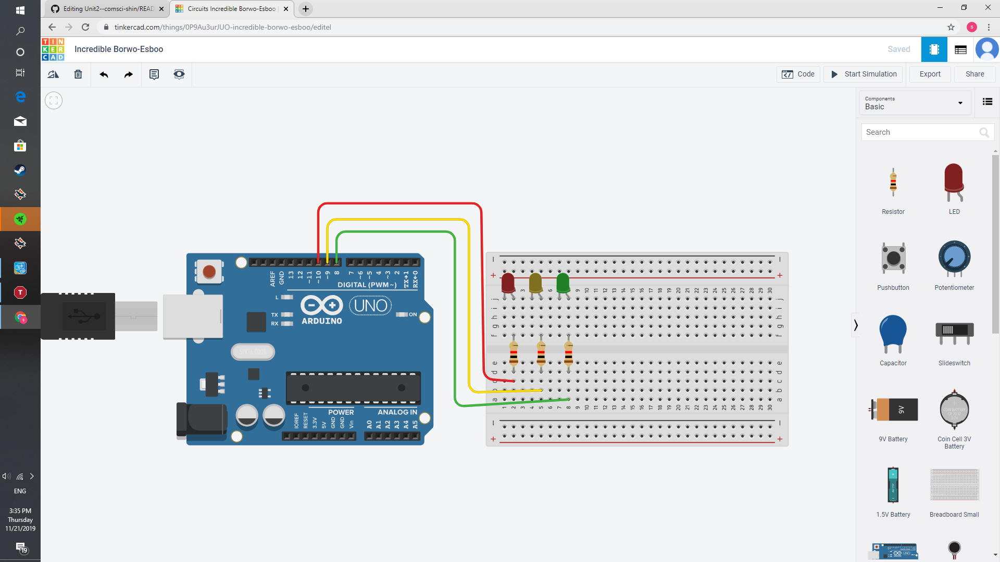

before void setup,
define each light as int based on connected port
``int red = 10;``

During void setup,
define light as output (buttons will be input)
``pinMode(red, Output);`` [where int "red" shows pinnumber, can be replaced by real number]

During void loop, (process)
to activate led 
``digitalwrite(red, HIGH);``
High-on
``digitalwirte(red, LOW);``
Low-off

3 Buttons, 2 leds, according to table

We had to replicate the input/output results of a tabale with 3 buttons and 2 led, this is the table

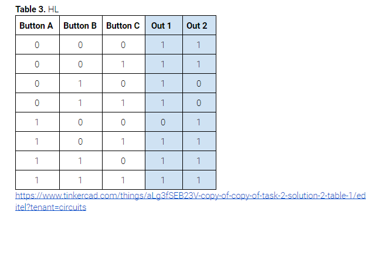

Here is the arduino circuitry

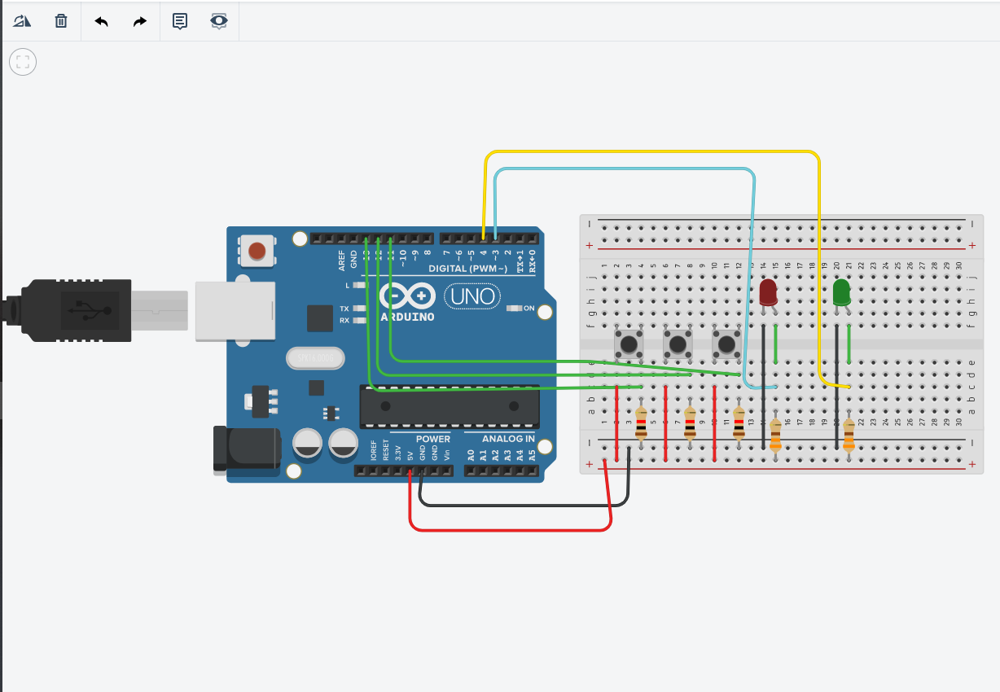


The code:
1.)create integers for every button and light, in void setup define buttons and lights as inputs and outputs
2.)Define "state" values which means a button has been pressed, StateA for button  A, StateB for button B, StateC for button C. These "state" variables will work to shorten code in if statements
3.)create if statements that correspond to each condition- for example for 001, ``if((!stateA && !stateB && stateC)){ digitalWrite(light1, HIGH); digitalWrite(light2, HIGH); }``
4.) repeat this process for every input condition.

The code is as follows


int buttonA = 13;
int buttonB = 12;
int buttonC = 11;
int light1 = 3;
int light2 =4;
int stateA = 0;
int stateB = 0;
int stateC = 0;


void setup()
{
  pinMode(buttonA, INPUT);
  pinMode(buttonB, INPUT);
  pinMode(buttonC, INPUT);
  pinMode(light1, OUTPUT);
  pinMode(light2, OUTPUT);
}


void loop()
{
  
  stateA = digitalRead(buttonA);
  stateB = digitalRead(buttonB);
  stateC = digitalRead(buttonC);
  if((!stateA && !stateB && !stateC)){
    digitalWrite(light1, HIGH);
 digitalWrite(light2, HIGH);
}

if((!stateA && !stateB && stateC)){
    digitalWrite(light1, HIGH);
  digitalWrite(light2, HIGH);
}


if((!stateA && stateB && !stateC)){
    digitalWrite(light1, HIGH);
  digitalWrite(light2, LOW);
}


if((!stateA && stateB && stateC)){
    digitalWrite(light1, HIGH);
  digitalWrite(light2, LOW);
}

if((stateA && !stateB && !stateC)){
    digitalWrite(light1, LOW);
  digitalWrite(light2, HIGH);
}

if((stateA && !stateB && stateC)){
    digitalWrite(light1, HIGH);
  
      digitalWrite(light2, HIGH);
}

 if((stateA && stateB && !stateC)){
    digitalWrite(light1, HIGH);
    digitalWrite(light2, HIGH);
} 
  
  if((stateA && stateB && stateC)){
    digitalWrite(light1, HIGH);
    digitalWrite(light2, HIGH);
}
}


***Learning C***
------------------
Introduction homework tasks (1/7/2020) 

Task 1- Write a C program that checks if two integers entered by the user are equal
https://repl.it/repls/SugaryQuarterlyTrials

Task 2-Write a C program that checks if a year provided by the user is a gap year
https://repl.it/repls/NumbWeakServers

Classwork on C (1/8/2020)
Basic Coding Tasks
https://github.com/Shin1203/Unit2--comsci-shin/blob/master/PractisingCClasswork.C

Practising with Loops
https://github.com/Shin1203/Unit2--comsci-shin/edit/master/programmingpractiseloopsC.C


**Project**
----------------
1.[Planning](#planning)

**Project Planning** 
------------------
**Defining the Problem**

The year is 2050, there is an established Moon base and Mars base.
A communication system must be created between earth and mars, and moon and mars. 
The problem is that the Earth station can only communicate with morse, while the Moon station can only use binary. 
This communication system has to have an input of english, and output of morse/binary, using only 2 button inputs as well as leds and buzzers. 
Must also be able to recieve messages- type in binary/morse convert to english.

**Sucess Criterions**
MOON BASE OPERATIONS
-Type in english and output morse
-Type in english and output binary
-Convert Morse to Binary
-Must be easy to use- (operator does not need to understand morse/binary)
-Materials used has to be
Only 2 buttons
2 Lightbulbs 
1 LCD monitor
Buzzers

**Conditions and problems**
-How to dissplay mssg in English?
-How to switch between input (Rx) and sending (7x)
-Discussing with Earth and Moon base the communication method of morse and binary through lightbulbs
-Switching between the different modes of communication

**2 buttons to alphabetical words**
TASK- Create a program that turns 2 button inputs into words, then print them to serial monitor, the program must allow for the user to switch between morse and binary through only the 2 buttons.
IDEA- Make the left button cycle from a-z, right button to select alphabetical letter to add to word, both buttons to print word.

Implementation- One button is used for cycling through a "keyboard" as displayed on the lcd monitor. The options will allow for selection of the different conversions- english to morse, english to binary, morse to binary. When one of these conversion methods are selected by button 2, the lights will transmit the typed in message. The two button cycling method makes usage very simple, without limiting any functionality of the program.

code for proof of concept of digital keyboard and cycling.
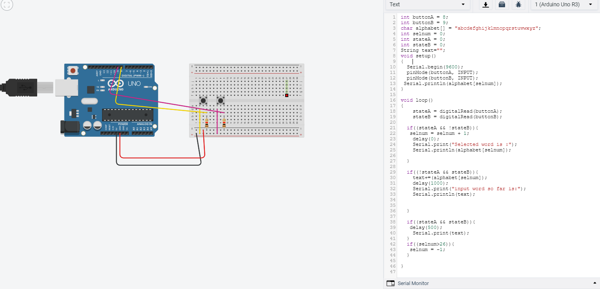


**Code and Diagrams**
---------------------
Flowchart for Keyboard usage
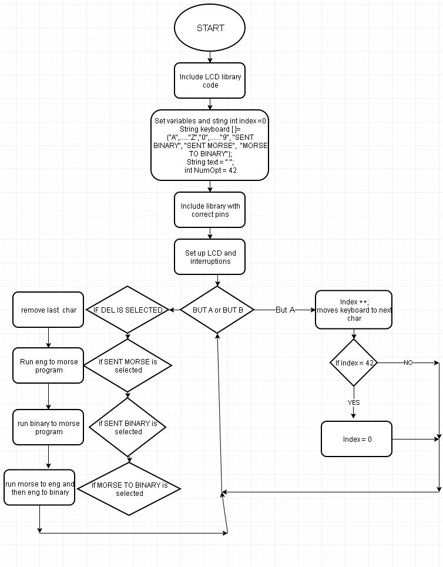

Flowchart for when "Send binary" is selected
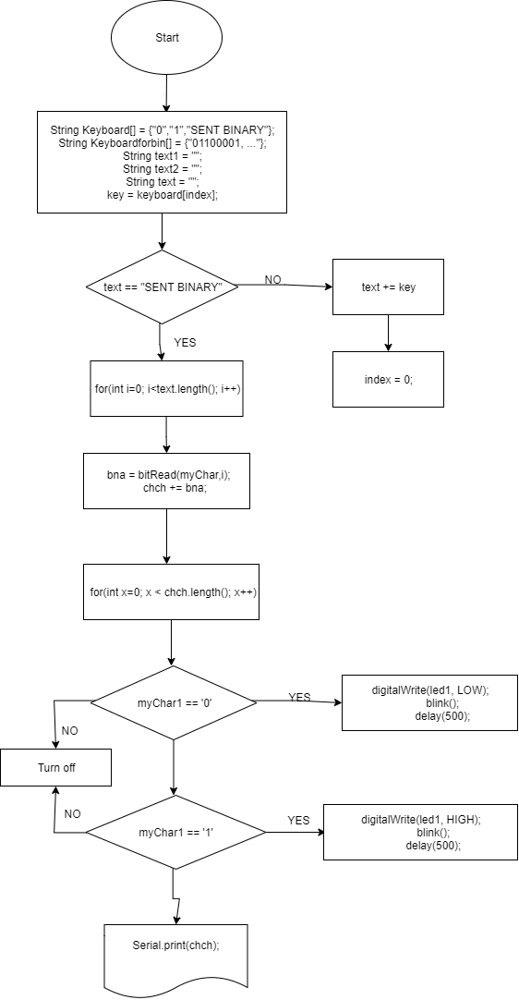

Flowchart for process in Morse to binary
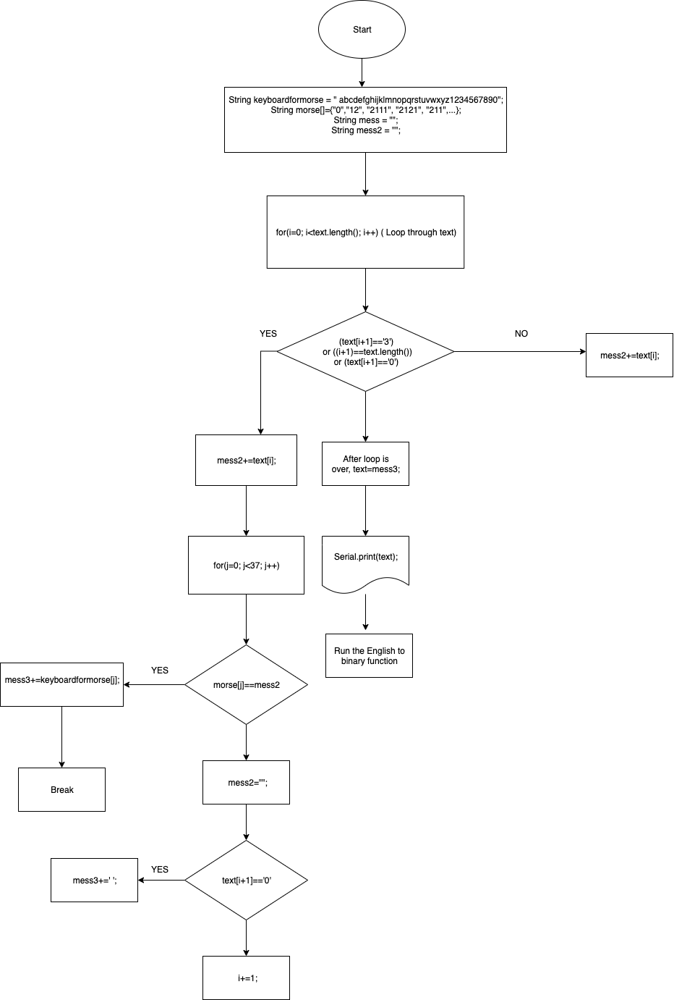

**CODE**
```
// include the library code:
#include <LiquidCrystal.h>
int index = 0; 
// add all the letters and digits to the keyboard
String keyboard[]={" ", "SENT BINARY","SENT MORSE", "MORSE TO BINARY", "1", "2", "3", "4", "5", "6", "7", "8", "9", "0","a", "b", "c", "d", "e", "f", "g", "h", "i", "j", "k", "l", "m", "n", "o", "p", "q", "r", "s", "t", "u", "v", "w", "x", "y", "z", "DEL"};
String keyboardformorse = " abcdefghijklmnopqrstuvwxyz1234567890";
String morse[]={"0","12", "2111", "2121", "211", "1", "1121", "221", "1111", "11", "1222", "212", "1211", "22", "21", "222", "1221", "2212", "121", "111", "2", "112", "1112", "122", "2112", "2122", "2211", "12222", "11222", "11122", "11112", "11111", "21111", "22111", "22211", "22221", "22222"};
String text = "";
char letter;
int numOptions = 39;
int led1 = 8;
int led2 = 13;
int i,j;
byte bna;
String chch = "";
String mess = "";
String mess2 = "";
String mess3= "";

// initialize the library with the numbers of the interface pins
LiquidCrystal lcd(12, 11, 7, 6, 5, 4);

void setup() {
  Serial.begin(9600);
  pinMode(led1, OUTPUT);
  pinMode(led2, OUTPUT);
  // set up the LCD's number of columns and rows:
  lcd.begin(16, 2);
  // Print a message to the LCD.
  attachInterrupt(0, changeLetter, RISING);//button A in port 2
  attachInterrupt(1, selected, RISING);//button B in port 3
 
}

void loop() {
  // set the cursor to column 0, line 1
  // (note: line 1 is the second row, since counting begins with 0):
  lcd.clear();
  lcd.setCursor(0, 0);
  lcd.print(keyboard[index]);
  lcd.setCursor(0, 1);
  lcd.print(text);
  delay(100);
}

//This function changes the letter in the keyboard
void changeLetter(){
  static unsigned long last_interrupt_time = 0;
  unsigned long interrupt_time = millis();
  if (interrupt_time - last_interrupt_time > 200)
  {
  
    last_interrupt_time = interrupt_time;// If interrupts come faster than 200ms, assum
    index++;
      //check for the max row number
    if(index==numOptions){
      index=0; //loop back to first row
    } 
 }
}

//this function adds the letter to the text or send the msg
void selected(){
  static unsigned long last_interrupt_time = 0;
  unsigned long interrupt_time = millis();
  if (interrupt_time - last_interrupt_time > 200)
  {
  
    last_interrupt_time = interrupt_time;// If interrupts come faster than 200ms, assum
    
    String key = keyboard[index];
    if (key == "DEL")
    {
      int len = text.length();
      text.remove(len-1);
    }
    else if(key == "SENT BINARY")
    {
      EtoB();
      turnOnOff();
      sentbin();
      turnOnOff();
      text="";
    } else if(key == "SENT MORSE"){
    	sentmorse();
    }
    else if(key== "MORSE TO BINARY"){
      MtoB();
    }
    
    else{
      text += key;
    }
    index = 0; //restart the index
  }
}

void EtoB(){

for(int i=0; i<text.length(); i++){

   char myChar = text.charAt(i);
 
    for(int i=7; i>=0; i--){
      bna = bitRead(myChar,i);
      chch += bna; 
    }
}
}

  
void sentbin(){
    for(int x=0; x < chch.length(); x++){
      char myChar1 = chch.charAt(x);
      if(myChar1 == '0'){
        digitalWrite(led1, LOW);
        blink();
        delay(500);
      } else if(myChar1 == '1'){
        digitalWrite(led1, HIGH);
        blink();
        delay(500);
      } else {
        turnOff();
      }
    }
  }

void blink(){
  digitalWrite(led2, HIGH);
  delay(500);
  digitalWrite(led2, LOW);
  delay(500);
}

void turnOnOff(){
 digitalWrite(led1, HIGH);
 digitalWrite(led2, HIGH);
 delay(500);
 digitalWrite(led1, LOW);
 digitalWrite(led2, LOW);
 delay(500);
}

void turnOff(){
 digitalWrite(led1, LOW);
 digitalWrite(led2, LOW);
 delay(500);
}

// Morse
void sentmorse(){
      for(i=0; i<text.length(); i++) {
        for(j=0; j<37; j++) {
          if(text[i]==keyboardformorse[j]){
            mess+=morse[j];
            break;
          }
        }
         
        mess+="3";
      }
       for(i=0; i<7; i++) {
        blinkLight(300, 300);
      }
      for(i=0; i<mess.length(); i++) {
        switch (mess[i]) {
          case '0':
          delay(3000);
          break;
          
          case '1':
          blinkLight(1000, 1000);
          break;
          
          case '2':
          blinkLight(3000, 1000);
          break;
          
          case '3':
          delay(1000);
          break;
        }
      }
      
      for(i=0; i<7; i++) {
        blinkLight(300, 300);
      }
          
      text="";
    }
  void MtoB() {
    for(i=0; i<text.length(); i++) {
      if((text[i+1]=='3') || ((i+1)==text.length())||(text[i+1]=='0')){
        mess2+=text[i];
        for(j=0; j<37; j++) {
          if(morse[j]==mess2) {
            mess3+=keyboardformorse[j];
            break;
          }
        }
        mess2="";
        if (text[i+1]=='0'){
          mess3+=' ';
        }
          i+=1; 
        
        }
      else {
      	mess2+=text[i];
      }
      
    } 
  text=mess3;
  Serial.print(text);
  EtoB();
  turnOnOff();
  sentbin();
  turnOnOff();
  text="";
  mess3="";
  }
    
    void blinkLight(int on, int off) {
      digitalWrite(led1, HIGH);
      delay(on);
      digitalWrite(led1, LOW);
      delay(off);
      
    }
    ```
